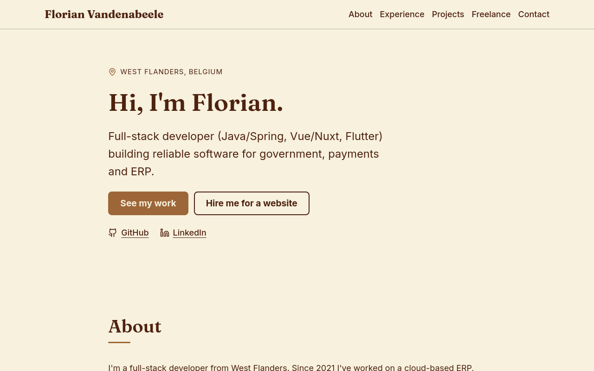

# florianvdab.com

[](https://github.com/Florianvdab/florianvdab.com/actions/workflows/ci.yml)
[](LICENSE)

Source of **[florianvdab.com](https://florianvdab.com)**, the portfolio of Florian Vandenabeele,
full-stack developer in West Flanders, Belgium.



A single-page static site: resume timeline, projects, and an offer for freelance static websites.
It ships **zero client-side JavaScript**, scores 100 on Lighthouse (mobile), and runs as a ~13 MB
non-root nginx container on a home server, published through a Cloudflare Tunnel.

## Tech stack

|           |                                                                                               |
| --------- | --------------------------------------------------------------------------------------------- |
| Framework | [Astro](https://astro.build) (static output), TypeScript strict                               |
| Content   | Astro content collections: JSON and Markdown, validated with Zod at build time                |
| Styling   | Plain CSS with custom properties, scoped component styles. No framework                       |
| Fonts     | Inter and Fraunces, self-hosted via Fontsource (no third-party requests)                      |
| Tests     | Vitest, `astro check`, Prettier                                                               |
| Serving   | `nginx-unprivileged` (alpine-slim) with a strict CSP and long-lived caching for hashed assets |
| CI        | GitHub Actions: checks, tests, build, Docker build + smoke test                               |

**Why Astro?** The site is 100% static, so a SPA framework would only add a JavaScript runtime for
nothing. Astro renders components to plain HTML at build time, and content collections keep the
resume in typed data files: adding a job or project means adding one file, not editing markup.

## Local development

Requires **Node 24** (see `.nvmrc`; `fnm use` or `nvm use` picks it up).

```sh
git clone https://github.com/Florianvdab/florianvdab.com.git
cd florianvdab.com
npm ci
npm run dev          # http://localhost:4321
```

| Command           | What it does                                           |
| ----------------- | ------------------------------------------------------ |
| `npm run dev`     | Dev server with hot reload                             |
| `npm run build`   | Build the static site into `dist/`                     |
| `npm run preview` | Serve the built `dist/` locally                        |
| `npm run check`   | Type-check `.astro` and `.ts` files                    |
| `npm test`        | Run unit tests (Vitest)                                |
| `npm run format`  | Format everything with Prettier (`format:check` in CI) |

## Editing content

The site is bilingual: English at `/`, Dutch at `/nl/`. All resume content lives in
`src/content/`, interface text in `src/i18n/ui.ts`, and language-neutral details (name, email,
links) in `src/data/site.ts`. The schemas in `src/content.config.ts` reject invalid files, so a typo
or a missing translation fails the build instead of silently rendering wrong.

- **Experience**: `src/content/experience/<company>.json`. Newest first by `start`; durations like
  "1 yr 4 mos" / "1 jaar 4 maanden" are computed from `start`/`end` (`YYYY-MM`, `end: null` =
  current role).
- **Projects**: `src/content/projects/<slug>.md`. Frontmatter only is fine; sorted featured first,
  then by `order`.
- **Translations**: text fields are `{ en, nl }`. Names that don't change (a company, a city, a
  product name) may be a plain string. `summary`, `pitch` and `highlights` must always have both.
- **Interface text**: add a key to both `en` and `nl` in `src/i18n/ui.ts`; a key missing from
  one language is a type error.

Adding a project:

```markdown
---
# src/content/projects/my-project.md
title: My Project # or { en: ..., nl: ... }
pitch:
  en: One sentence on what it is.
  nl: Eén zin over wat het is.
highlights:
  en: [Up to five short bullet points]
  nl: [Tot vijf korte opsommingstekens]
tech: [TypeScript, PostgreSQL]
repo: https://github.com/Florianvdab/my-project # omit for private projects
private: false # true shows a "Private repo" badge and a "Demo on request" link
featured: true
order: 5
---
```

Social preview and icons are rendered from sources in [`design/`](design/README.md).

## Running with Docker

```sh
docker compose -f compose.dev.yaml up --build web          # production image, http://127.0.0.1:8091
docker compose -f compose.dev.yaml --profile dev up dev     # hot-reload dev server, http://127.0.0.1:4321
# set LAN_BIND=0.0.0.0 in a (gitignored) .env to open both to your local network
# or
docker build -t florianvdab-site . && docker run --rm -p 8080:8080 florianvdab-site
```

The image listens on **8080** as a non-root user, works with a read-only root filesystem
(`--read-only --tmpfs /tmp`), and has a `HEALTHCHECK`.

## Deployment

The production server builds the image itself from `main`, so there's no registry involved.
Anything on a Docker host with an existing [Cloudflare Tunnel](https://developers.cloudflare.com/cloudflare-one/connections/connect-networks/)
works like this:

1. Copy [`deploy/compose.example.yaml`](deploy/compose.example.yaml) to the server (e.g.
   `~/stacks/website/compose.yaml`) and start it:
   ```sh
   docker compose up -d --build
   curl -I http://127.0.0.1:8090      # 200 + security headers
   ```
   The port is published on `127.0.0.1` only: the tunnel reaches it, the LAN doesn't.
2. In **Cloudflare Zero Trust → Networks → Tunnels → your tunnel → Public hostnames**, add
   `florianvdab.com` (and `www`, if wanted) with service `http://localhost:8090`. Cloudflare creates
   the DNS records itself, which requires the domain's DNS to be on Cloudflare. TLS and HSTS are
   handled at Cloudflare's edge.
3. Optionally redirect `www` to the apex with a Cloudflare redirect rule.

**No tunnel yet?** Add a `cloudflared` service to the same compose file
(`image: cloudflare/cloudflared`, `command: tunnel --no-autoupdate run`, `TUNNEL_TOKEN` from a
`.env` file) and point the public hostname at `http://website:8080` instead.

### Updating

```sh
docker compose up -d --build      # re-fetches main, rebuilds, swaps the container
```

On the home server this runs nightly from cron. That also rebuilds the "Present" job durations,
which are computed at build time.

## Project structure

```
.github/workflows/ci.yml   checks, tests, build, Docker smoke test
deploy/                    example production compose file
design/                    sources + render script for og-image and icons
docker/                    nginx server config and security headers
docs/PLAN.md               roadmap and decisions
public/                    favicons, og-image, robots.txt (copied as-is)
src/
  components/              page sections (Hero, Experience, ProjectCard, …)
  content/                 experience (JSON) and projects (Markdown), text in { en, nl }
  content.config.ts        Zod schemas
  data/site.ts             name, email, links, CV
  i18n/                    locales and all interface text (ui.ts)
  layouts/Base.astro       <head>: SEO, Open Graph, icons
  lib/duration.ts          date formatting + tests
  pages/                   / (en), /nl/ and the bilingual 404
  styles/global.css        design tokens, reset, shared classes
```

## License

[MIT](LICENSE) © Florian Vandenabeele
